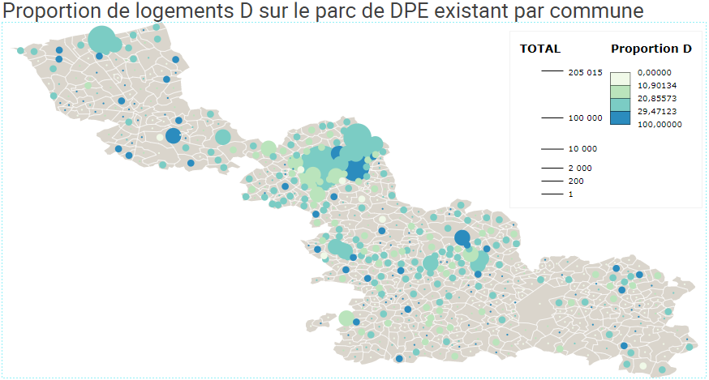

La rénovation énergétique du parc de logements français représente une étape majeure dans la transition énergétique que souhaite opérer la France. A la suite de la convention citoyenne pour le climat, le sujet a d’ailleurs été largement approuvé car les économies potentielles en énergie sont immenses. Ainsi, de nombreuses politiques et subventions se succèdent depuis plusieurs années pour favoriser une réduction de la consommation énergétique des foyers français : la meilleure énergie, c’est celle qu’on ne consomme pas.

Notre souhait initial a été d’observer l’évolution de l’activité de rénovation énergétique des logements à l’échelle des régions françaises. Mais l’absence de données libres d’accès nous a contraint à revoir notre angle. Nous avons donc fait le choix d’étudier l’état du parc immobilier du département du Nord en nous basant sur les diagnostics de performance énergétique des logements. 

Tel que défini par le ministère de la Transition écologique, le DPE _“décrit le bâtiment ou le logement (surface, orientation, murs, fenêtres, matériaux, etc), ainsi que ses équipements de chauffage, de production d’eau chaude sanitaire, de refroidissement et de ventilation. Il indique, suivant les cas, soit la quantité d’énergie effectivement consommée (sur la base de factures), soit la consommation d’énergie estimée pour une utilisation standardisée du bâtiment ou du logement.”_

L’étude des DPE du parc immobilier du Nord nous permettra d’obtenir un aperçu de l’état des logements et de leur niveau de consommation énergétique mais aussi du nombre potentiel de logements ayant fait l’objet d’une rénovation énergétique. En effet, nous partons ici du principe qu’un logement ancien mais économe a été rénové. 

# PRÉSENTATION DU SUJET ET DE LA MÉTHODE 

La première version de notre travail visait à étudier à l’échelle régionale le nombre de rénovations énergétiques effectuées chaque années et de comparer plusieurs régions entre elles pour en déduire les raisons derrière d’éventuelles disparités. Nous avions pour cela besoin des informations dont, par exemple, le nombre de rénovations effectuées ou si celles-ci avaient bénéficié d’aide de l’Etat ou des collectivités territoriales. Ces informations sont collectées par les CERC. Or, aucun parmi eux n’a accepté de fournir ces données et celles mises en ligne étaient limitées et ne suffisaient pas à établir une base d’analyse. 

Nous avons pour cette raison redirigé nos efforts vers un plus petit dénominateur, le département, et plus spécifiquement le département du Nord (59). Nous souhaitions, à partir de l’exploitation de données librement accessibles, entamer une réflexion sur l’état du parc immobilier du département en matière d’énergie, révéler les éventuelles disparités et comparer la consommation énergétique des logements selon les périodes.

Afin de permettre cette analyse, plusieurs jeux de données ont dû être utilisés. Notre première source, sur laquelle repose les autres, est la base des diagnostics énergétiques des logements du Nord mise en ligne par l’ADEME. Chaque ligne correspond à un logement auquel est associé, entre autres, une adresse postale complète et l’année de construction du bâtiment évalué. Ce document était composé de près de 325 000 entrées. Toutes les informations n'étaient pas correctement remplies et un travail de nettoyage sur lequel nous revenons en annexe s’est imposé.  

Un des problèmes rencontrés était la mauvaise écriture du nom des villes, certaines comportant des caractères spéciaux comme des tirés ou des espaces en trop. Nous avons corrigé ces erreurs en faisant appel à une base de données INSEE comprenant, pour chaque code INSEE, la ville qui lui est associée. Nous avons relié les bases de données entre elles à l’aide de Workbench Data afin d’obtenir une écriture standardisée des différents noms de ville pour permettre l’étude des performances énergétiques du parc de chaque ville. 

Une démarche similaire a été réalisée à l’aide d’une base de données établie par La Poste comprenant une position géographique pour chaque ville de France. L’obtention d’une latitude et d’une longitude était une information essentielle de pouvoir situer sur la carte les lieux étudiés et réaliser une cartographie précise. 

Enfin, la base de logement INSEE de 2016 nous a permis de connaître le nombre de résidences primaires et secondaires dans le département. 

Nous l’avons vu, la base de diagnostic des bâtiments du Nord est vaste. Pour gagner en lisibilité, nous avons décidé de nous concentrer sur les bâtiments réparties en quatre périodes distinctes. La première catégorie de logements comprendra les bâtiments construits avant 1950, la seconde les bâtiments compris entre 1950 et 1980, puis ceux compris entre 1980 et 2000 et, pour la quatrième période, ceux compris entre 2000 et 2010. Nous avons décidé de ne pas prendre en compte les bâtiments construits après 2010 car les normes récentes et l’actualité de leur construction rendent quasi improbable des travaux de rénovation énergétique.  Prenons note que le département du Nord a connu de nombreuses destructions pendant la seconde guerre mondiale, impliquant un fort travail de reconstruction à la sortie de la guerre et donc un nombre plus important de logements construits durant cette période comparé à d’autres territoires. 

Les normes s’améliorant avec le temps, les logements produits durant les deux dernières périodes devraient offrir une meilleure isolation énergétique. En gardant cette logique en mémoire, il est possible de déduire, à partir du DPE actuel d’un logement et de sa période de construction, si celui-ci a bénéficié de travaux de rénovation énergétique. En effet, les techniques de construction au moment de la construction d’un bâtiment à la fin des années 1940 ne permettaient pas au bâtiment d’être aussi isolé comme un bâtiment moderne et, en conséquence, d’obtenir une notation élevée.

# Comparaison des DPE selon les périodes

Au cours de notre analyse du jeu de données nous avons longuement échangé au sujet de la visualisation. Quelle facette mettre en avant dans l’observation des DPE du département du Nord? Comment montrer efficacement les changements, les variations, les proportions différenciées entre les communes?  Comment pouvoir observer des tendances au niveau départemental?

Les diagrammes en barre apparaissent ainsi comme des outils incontournables et visuellement pertinents pour représenter les données que nous avons pu synthétiser dans nos travaux. Ici pour observer les “parts” de DPE au niveau du parc immobilier départemental répertorié dans nos données. Effectivement comme nous pouvons le voir, le double découpage en classe d’âge et en DPE nécessite une visualisation “croisée”, qui couplée avec un sankey Diagram permet d’obtenir une visualisation nette de la part de logements par DPE et des proportions pour chaque classe d’âge. En effet, si indépendamment les trois visualisations viennent corroborer certaines informations. Il n’en reste pas moins que c’est par l’articulation des trois réunies que l’analyse prend ici son sens.

Nous pouvons notamment prendre pour exemple cette première visualisation qui permet de manière effective d’observer la proportion de logements isolés. Comme nous pouvons le constater ici; les logements construits avant  1950 comportent une part relativement faible de DPE “vertes” classées A,B ou C (seulement 23%) tandis que pour les logements construits entre 2000 et 2010 cette part passe à près de 36%. Cependant, l’absence d'unité claire de référence nécessite une seconde visualisation pour avoir une idée plus précise de la réalité. 

C’est ici qu’intervient notre 2nd diagramme qui nous permet d’observer qu’en “volume” de logements, la part du parc immobilier construit avant 1950 et bien plus important que celui construit entre 2000 et 2010 (comme nous avons pu l’expliquer précédemment). Ce diagramme nous aide ainsi à voir qu’en réalité ce volume de logements est aussi supérieur lorsque l'on s’intéresse aux DPE vertes qui représentent 20000 logements tandis que seulement 9000 sont catégorisés de la sorte pour la période 2000-2010. 

Enfin, la visualisation Sankey-Diagram permet d’observer cette même distribution par DPE et classe d’âge de manière plus “dynamique” que les deux visualisations précédentes et inclut quant à elle les logements ou la DPE n’a pas été possible via la lettre “N” et permet ainsi de renforcer la part prépondérante que tiennent les logements construits avant 1950 dans notre visualisation. 

Ainsi, nous remarquons, malgré une proportion qui en apparence peut paraître faible par rapport à la classe d’âge, que de nombreux logements anciens ont pu être rénovés dans le département du nord, mais qu’un grand nombre de logements présentant une mauvaise isolation n’ont pas encore bénéficié des travaux et des différentes subventions proposés. Le département du Nord présente encore de nombreux axes de progression dans l’amélioration énergétique de son parc immobilier bâti pour les prochaines années. Le territoire doit faire des efforts supplémentaires pour respecter les objectifs formulés par le gouvernement français.

# APERÇU GENERAL DU PARC DE LOGEMENT

Le fichier étudié recensait, avant son nettoyage, les informations de près de 325 000 logements soit près d’un quart des 1 204 509 recensés dans le département par l’INSEE en 2016. Chaque entrée correspond à une construction pour un particulier sans distinction de entre logement primaire et secondaire. 

Cette visualisation permet d’observer, pour chaque ville du territoire du Nord, la proportion de logements catégorisés A, répartie en 4 paliers, selon la taille du parc de la ville. Une ville vert foncé avec un gros point correspond donc à une ville avec un nombre important de logements et dont une forte partie de ces logements ont un DPE classé A. A l’inverse, un petit point clair correspond à une ville ayant peu de résidence et dont une faible part d’entre elles ont un DPE classé A. Mettre en avant la proportion de logements catégorisés A par un système de couleur est plus juste que de mettre en avant le nombre réel de logements car les grandes villes et les agglomération seraient artificiellement favorisés par ce traitement. 

On observe que les villes disposant d’une part importante dans parc de DPE A ne sont pas réparties équitablement sur le territoire ni dans les tailles de villes. Le centre du département, soit la métropole lilloise et ses alentours, concentre l’essentiel des villes de taille moyenne ou importante ayant un pourcentage de DPE A compris entre le second et le troisième quartile. Les villes “blanches” et de taille moyenne se trouvent pour l’essentiel dans la moitié inférieur du département. **Ainsi, un contraste se forme entre un sud dont le nombre de logements au DPE A est très peu important et un nord, caractérisé par un nombre important de villes moyennes ayant une proportion importante de logements classés A.**

La métropole lilloise, qui concentre le plus grand nombre d’habitants du territoire, se distingue négativement du reste des villes de taille plus modeste sur la proportion de ses habitations classées A. 

A contrario, la proportion de logements catégorisés D semble répartie de manière plus homogène sur le territoire, la majorité des logements se trouvant dans le troisième quartile. 

Dans la lignée des premières observations effectuées sur les logements catégorisés A, la fracture entre le nord et le sud du département s’observe ici autour des logements catégorisés F. La part de logement DPE F, mal isolés et en conséquence fortement consommateurs en énergie, est plus importante dans le sud du département, petites et moyennes villes confondues, quand les villes du nord du département sont plus claires, excepté certains cas qui ressortent en raison du contraste, et disposent donc moins de cette catégorie de logement. 

# CONCLUSION

Au terme de nos travaux, nous avons pu mettre en lumière plusieurs éléments qui, sans pour autant parler de tendance, nous permettent d'avoir une idée de la situation actuelle sur le parc de logements répertoriés dans la DPE du Nord pour 2017. La mise en évidence de la part de logements anciens très largement supérieure aux autres classes d’âge est un premier anciennement. La part de logements avec une DPE “verte” représente une proportion non-négligeable du parc immobilier d’avant 1950, cependant il nous est difficile de cartographier réellement les efforts des collectivités et les tendances en cours mais les infographies proposées permettent d’avoir “une photographie” du travail qu’il reste à accomplir pour les collectivités.

Aussi, la répartition sur le territoire des différentes catégories de consommation énergétique n’est pas homogène. Nous l’avons vu, une fracture apparaît entre le nord du département où la part de logement faible en consommation énergétique est supérieure à celle du sud. 

Cependant, les interprétations dans notre travail sont limitées pour plusieurs raisons : 

# Boite noire

1. Il est difficile d’articuler les données obtenues pour conclure à un véritable enseignement. En effet, la photographie disponible des DPE à l’échelle du département l’était sur une seule année, ne permettant ainsi pas d’effectuer des comparaisons entre les périodes et d’en déduire les efforts réalisés par les collectivités territoriales. De plus, ces déduction se basent sur un nombre limité d’informations qui pourraient trahir le réel en supposant, par exemple, à partir de la date de construction d’un bâtiment, sa consommation énergétique sans même connaître la qualité de construction du bâtiment. 
2. **L’utilisation de l’outil même du DPE est une limite en soi**. Cet indicateur est construit en partie à partir de la consommation d’énergie en énergie primaire kWhep du bâtiment. Ainsi, un ménage composé d'individus sensibles au froid chauffant leur habitation à 21°C n’obtiendra pas la même note que si y avait habité des individus se chauffant à 18°C. De plus, l’utilisation d’une cheminée, comme cela peut être le cas dans les vieilles maisons, ne sera pas prise en compte alors qu’elle constitue une source de chaleur non négligeable et peut considérablement réduire la facture de chauffage en période hivernale.
3. Enfin, si 325 000 habitations étaient à l’origine présentes dans notre base de données, le ménage effectué et les critères établis ont abouti à 276 000 habitations effectivement intégrés dans notre analyse, signe que la base de données proposée par l’ADEME reste limitée en termes d’utilisation effective directe.
